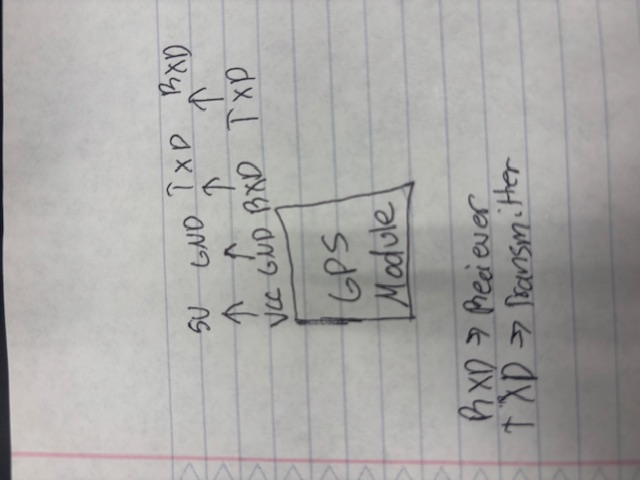

# Real Time Planet Tracker
My project is a real time planet tracker. What this project does is it tracks the planets coordinates using azimuth and altitude and points to where the planet is in the sky with a servo with a laser attached. This can go through all planets execpt earth and you can control what planet is calculates with a button. The main challenges I faced was dealing with the Servo tangling due to over rotations, Dealing with the Azimuth and Altitude Math, and dealing with a not working IMU which I decided to scrap. 

| **Engineer** | **School** | **Area of Interest** | **Grade** |
|:--:|:--:|:--:|:--:|
| Aaditya P | California High School| Aerospace Engineering | Incoming Senior


  
# Final Milestone

# Summary

My final milestone in my project is just finishing the project and making sure everything works. For my final project I have a working real time planet tracker which uses azimuth and altitude calculations to see where each planet is real time in our solar system. For my project I have it calculating  the following planets in order: Mercury, Venus, Mars, Saturn, Jupiter, Uranus, Neptune, Pluto. To visually see where each planet is I am using a servo with a laser attached to it to point at the planets so you can see the direction where they are. 


# Challenges


For this project there were tons of challenges but the main ones were involved with the code. One of the biggest problems was the GPS working with the Math. The gps would need a start time for it to work so if anything would print before that it would print the wrong values. To fix this I added delay so the math would only start going when the GPS would work so the GPS would produce the correct values and this worked. Another big problem I had was with Sin functions in C++. The problem was C++ doesnt give right outputs for sin functions in degrees. TO fix this I put my math in Radians and then covered them to degrees when it was time to print. 

# Second Milestone


<iframe width="560" height="315" src="https://www.youtube.com/embed/K05nV2iawsE?si=kE9Uvx09qNqWfP08" title="YouTube video player" frameborder="0" allow="accelerometer; autoplay; clipboard-write; encrypted-media; gyroscope; picture-in-picture; web-share" referrerpolicy="strict-origin-when-cross-origin" allowfullscreen></iframe>

# Summary 

My second milestone in my project is making sure the calculations for the Azimuth and Altitude were working well. So to test that they work I use the planet Mars and told the code to print out the azimuth, altitude, right ascention, and declination. This is to basically find the coordinates of where the planet is at and it works well. For my future milestones I plan on adding all the other planets in the solar system and cycle them using a button switcher.  

# Challenges 

The main challenge I faced with this part was the servo over rotating and chocking itself which messes up the connections with the breadboard and ardino. To fix this I just shorted the rotation to only 360 degrees and this worked because my servo motor stopped chocking itself. Another problem I had was figuring out what I was going to do with the IMU since it was not working at all. What I decided to do is to scrap the IMU and just angle the Servos North for the most accurate results. Another big problem I had was just learning the math because it was super complicated with 8 steps and steps 1-8 were all just plugging it in but step 9 was the most complex because I needed to know pretty complex. What took the most time was realizing that I couldnt just use hardcoded values for this and I realized it way to late and this took a huge tank of my time. 

# First Milestone

<iframe width="560" height="315" src="https://www.youtube.com/embed/h4RonOS_DbQ?si=PFpO-KHJd071FopQ" title="YouTube video player" frameborder="0" allow="accelerometer; autoplay; clipboard-write; encrypted-media; gyroscope; picture-in-picture; web-share" referrerpolicy="strict-origin-when-cross-origin" allowfullscreen></iframe>

# Summary

My first milestone in my project is making sure all of the connections in the breadboard and Arduino work. This includes connecting the servo motors, GPS module, and IMU. To make this work, I ran a simple code to test everything out. For my future milestones, I am planning on making a better code so it can track the planets, and also improve the servo motor and attach the laser to it. 

# Challenges

Some challenges I faced with this first milestone include making sure all of the connections were correct and what I did to help me through this problem was cross refernecing outside sources to make sure it was correct. Another Problem I had was building the servo motor since it was very difficult due to the small screws and it would break very easily. What I did to overcome this problem was just going through the steps very slowly so I ensure there is no mistakes. 

# Schematics 


<a href="https://paulplusx.wordpress.com/2016/03/03/rtpts_hw/">shubhampaul tinkercad</a>



# Code

```python
#include <TinyGPSPlus.h>
#include <Wire.h>
#include <Adafruit_PWMServoDriver.h>
#include <math.h>

// ── Hardware settings ─────────────────────────────────────────
Adafruit_PWMServoDriver pwm;   // PCA9685 @ 0x40
TinyGPSPlus            gps;   // GPS on Serial2

const uint8_t  PAN_CH   = 0,
               TILT_CH  = 1,
               BTN_PIN  = 44;                  // active-LOW button
const uint16_t PAN_MIN  = 1440, PAN_MAX  = 1675,  // µs THIS MEANS 1440 is equal to 0 deg and 1672 is equal to 359 deg
               TILT_MIN = 400, TILT_MAX = 2500;  // µs 

// ── J2000 heliocentric elements (VSOP87 two-body) ────────────
struct Elem { double a,e,I,L,P,O,n; };
static const Elem PL[9] = {
  {0.38709893,0.20563069, 7.00487,252.25084, 77.45645, 48.33167,4.09233445},
  {0.72333199,0.00677323, 3.39471,181.97973,131.60247, 76.67069,1.60213603},
  {1.00000011,0.01671022,-0.00015,100.46435,102.94719,-11.26064,0.98560899},
  {1.52366231,0.09341233, 1.85061,355.45332,336.04084, 49.57854,0.52403979},
  {5.20336301,0.04839266, 1.30530, 34.40438, 14.75385,100.55615,0.08308677},
  {9.53707032,0.05415060, 2.48446, 49.94432, 92.43194,113.71504,0.03344414},
  {19.19126393,0.04716771, 0.76986,313.23218,170.96424, 74.22988,0.01172834},
  {30.06896348,0.00858587, 1.76917,304.88003, 44.97135,131.72169,0.00602076},
  {39.48168677,0.24880766,17.14175,238.92881,224.06676,110.30347,0.00395800}
};
const uint8_t IDX[8] = {0,1,3,4,5,6,7,8};
const char*   NAME[8] = {
  "Mercury","Venus","Mars","Jupiter",
  "Saturn","Uranus","Neptune","Pluto"
};

// ── Math helpers ─────────────────────────────────────────────
#define D2R (M_PI/180.0)
#define R2D (180.0/M_PI)
static inline double d2r(double d){ return d * D2R; }
static inline double r2d(double r){ return r * R2D; }
static inline double wrap360(double x){ x = fmod(x,360.0); return x<0?x+360.0:x; }
static inline double wrap2pi(double x){ x = fmod(x,2*M_PI); return x<0?x+2*M_PI:x; }

// ── Julian Day & GMST ────────────────────────────────────────

// verify that Julian Day is correct
static double julianDayUTC(int Y,int M,int D,double hr){
  if(M<=2){ Y--; M+=12; }
  int A=Y/100, B=2-A+A/4;
  long J=(long)(365.25*(Y+4716)) + (long)(30.6001*(M+1)) + D + B - 1524;
  return J + hr/24.0;
}

static double gmstDeg(double jd){
  double T=(jd-2451545.0)/36525.0;
  double g=280.46061837 + 360.98564736629*(jd-2451545.0)
         + 0.000387933*T*T - T*T*T/38710000.0;
  return wrap360(g);
}

// ── Kepler & coordinate chain ────────────────────────────────
static double meanAnom(const Elem &e,double d){ return wrap360(e.n*d + (e.L - e.P)); }

static double trueAnom(double Mdeg,double e){
  double M = d2r(Mdeg);
  double v = M
           + (2*e - pow(e,3)/4)*sin(M)
           + 1.25*e*e*sin(2*M)
           + (13.0/12.0)*pow(e,3)*sin(3*M);
  return wrap360(r2d(v));
}

static double radiusAU(const Elem &e,double vdeg){
  return e.a*(1 - e.e*e.e) / (1 + e.e*cos(d2r(vdeg)));
}

static void heliocXYZ(const Elem &e,double v,double r,
                      double &x,double &y,double &z){
  double O=d2r(e.O), I=d2r(e.I), w=d2r(e.P-e.O), vR=d2r(v);
  double cO=cos(O), sO=sin(O), cI=cos(I), sI=sin(I);
  double cv=cos(vR+w), sv=sin(vR+w);
  x = r*(cO*cv - sO*sv*cI);
  y = r*(sO*cv + cO*sv*cI);
  z = r*(sv*sI);
}

static void ecl2eq(double x,double y,double z,double &X,double &Y,double &Z){
  double eps=d2r(23.43928);
  X=x; Y=y*cos(eps)-z*sin(eps); Z=y*sin(eps)+z*cos(eps);
}
static void raDec(double X,double Y,double Z,double &ra,double &dec){
  ra  = wrap360(r2d(atan2(Y,X)));
  dec = r2d(atan2(Z, sqrt(X*X+Y*Y)));
}

// ── Horizon (all in RADIANS, output rad) ───────────────────── there is no ouput...? want end values in degrees anyways

static void horizonRad(double jd, double lon, double lat, double ut, double ra, double decDeg, double &altDeg, double &azDeg) {
  
  // adding delay for sensors to start up and get values
  //delay(1000);

  double lst = 100.46 + (0.985647 * (jd - 2451545.0)) + lon + (15 * ut); // LST: local sidereal time
  
  // if negative, add 360 to make positive/between 0 and 360
  if (lst < 0) {
    lst = lst + 360;
  }

  double ha = lst - ra; // both of these are degrees for this calculation

  // same for hour angle
  if (ha < 0) {
    ha = ha + 360;
  }

  double decRad = decDeg * D2R;
  double latRad = lat * D2R;
  double haRad = ha * D2R;

  double altRad = (sin(decRad) * sin(latRad)) + (cos(decRad) * cos(latRad) * cos(haRad)); // altitude in radians
  altRad = asin(altRad);

  altDeg = altRad * R2D;

  // a is used in the calculation of the azimuth - here it is in radians
  double a = (sin(decRad) - (sin(altRad) * sin(latRad))) / (cos(altRad) * cos(latRad));
  a = acos(a);

  double aDeg = a * R2D; // convert it into degrees

  if (sin(haRad) < 0){
    azDeg = aDeg;
  }

  else{
    azDeg = 360 - aDeg;
  }

  //Serial.print("ut: ");
  //Serial.println(ut);

  //for (int i = 0; i < 1000; i++) {
    //Serial.println(i);
    
    //Serial.print("Altitude: ");
    //Serial.println(altDeg);

    //Serial.print("Azimuth: ");
    //Serial.println(azDeg);
  //}
}

/*

static void horizonRad(double jd, double lon, double lat, double ut, double ra, double decDeg, double &altDeg, double &azDeg) {
  // have a for loop that runs for awhile to get the right values, then update. initialize all variables outside loop

  double lst, ha, decRad, latRad, haRad, altRad, a, aDeg;

  for (int i = 0; i < 1000; i++) {

    lst = 100.46 + (0.985647 * (jd - 2451545.0)) + lon + (15 * ut); // LST: local sidereal time
    
    // if negative, add 360 to make positive/between 0 and 360
    if (lst < 0) {
      lst = lst + 360;
    }

    ha = lst - ra; // both of these are degrees for this calculation

    // same for hour angle
    if (ha < 0) {
      ha = ha + 360;
    }

    decRad = decDeg * D2R;
    latRad = lat * D2R;
    haRad = ha * D2R;

    altRad = (sin(decRad) * sin(latRad)) + (cos(decRad) * cos(latRad) * cos(haRad)); // altitude in radians
    altRad = asin(altRad);

    altDeg = altRad * R2D;

    // a is used in the calculation of the azimuth - here it is in radians
    a = (sin(decRad) - (sin(altRad) * sin(latRad))) / (cos(altRad) * cos(latRad));
    a = acos(a);

    aDeg = a * R2D; // convert it into degrees

    if (sin(haRad) < 0){
      azDeg = aDeg;
    }

    else{
      azDeg = 360 - aDeg;
    }

  }

  //Serial.print("LST: ");
  //Serial.println(lst);

  //Serial.print("Altitude: ");
  //Serial.println(altDeg);

  //Serial.print("Altitude: ");
  //Serial.println(altDeg);

  //Serial.print("Altitude: ");
  //Serial.println(altDeg);

  //Serial.print("Azimuth: ");
  //Serial.println(azDeg);
}

*/

// ── Compute RA/Dec (deg) ─────────────────────────────────────
static void computeRaDec(uint8_t idx,double jd,double &raDeg,double &decDeg)
{
  const Elem &p=PL[idx], &e=PL[2];
  double d = jd - 2451545.0;

  double Mp=meanAnom(p,d), vp=trueAnom(Mp,p.e), rp=radiusAU(p,vp);
  double xp,yp,zp; heliocXYZ(p,vp,rp,xp,yp,zp);

  double Me=meanAnom(e,d), ve=trueAnom(Me,e.e), re=radiusAU(e,ve);
  double xe,ye,ze; heliocXYZ(e,ve,re,xe,ye,ze);

  double X=xp-xe, Y=yp-ye, Z=zp-ze, Xq,Yq,Zq;
  ecl2eq(X,Y,Z,Xq,Yq,Zq);
  raDec(Xq,Yq,Zq, raDeg, decDeg);
}

// ── Servo mapping ─────────────────────────────────────────────
static uint16_t mapPWM(double v,double in0,double in1,
                       uint16_t o0,uint16_t o1){
  return o0 + (uint16_t)((v - in0)*(o1 - o0)/(in1 - in0));
}
static void moveServos(double azDeg,double altDeg){
  altDeg = constrain(altDeg,0.0,90.0);
  uint16_t pan = mapPWM(azDeg, 0,360, PAN_MIN, PAN_MAX),//azDeg
           til = mapPWM(-altDeg, -90, 90, TILT_MIN, TILT_MAX);//-altDeg bc its reversed
  pwm.writeMicroseconds(PAN_CH , constrain(pan, PAN_MIN, PAN_MAX));
  pwm.writeMicroseconds(TILT_CH, constrain(til, TILT_MIN, TILT_MAX));
}

// ── Globals & setup/loop ─────────────────────────────────────
int  curIdx     = 0, lastPrinted = -1;
bool btnLatched = false;

//int validCount = 0; // counts number of discards we have done
//const int MIN_VALID_READINGS = 50; // Number of reads to discard

void setup() {
  Serial.begin(9600);
  Serial2.begin(9600);
  //delay(1000);
  Wire.begin(); pwm.begin(); pwm.setPWMFreq(50);
  pinMode(BTN_PIN, INPUT_PULLUP);
}

void loop() {
  // feed GPS parser
  while (Serial2.available()) gps.encode(Serial2.read());

  if (!gps.date.isValid() || !gps.time.isValid()) {
    //Serial.println("Waiting for valid GPS time...");
    return;
  }


  //if (validCount < MIN_VALID_READINGS) {
    //validCount++;
    //Serial.print("Discarding GPS reading #"); Serial.println(validCount);
    //return;
  //}


  // get UTC date/time
  int y,m,d,h,mn,s; double hr;
  /*
  for (int i = 0; i < 1000; i++) {
    if (gps.date.isValid() && gps.time.isValid()) {
      y  = gps.date.year();
      m  = gps.date.month();
      d  = gps.date.day();
      h  = gps.time.hour();
      mn = gps.time.minute();
      s  = gps.time.second();
    } else {
      // fallback to compile-time
      char Mstr[4]; sscanf(__DATE__,"%3s %d %d", Mstr, &d, &y);
      const char* mo="JanFebMarAprMayJunJulAugSepOctNovDec";
      m = (strstr(mo,Mstr)-mo)/3 + 1;
      sscanf(__TIME__,"%d:%d:%d", &h, &mn, &s);
    }
    hr = h + mn/60.0 + s/3600.0;
  }
  */

  
  if (gps.date.isValid() && gps.time.isValid()) {
    y  = gps.date.year();
    m  = gps.date.month();
    d  = gps.date.day();
    h  = gps.time.hour();
    mn = gps.time.minute();
    s  = gps.time.second();
  } else {
    // fallback to compile-time
    char Mstr[4]; sscanf(__DATE__,"%3s %d %d", Mstr, &d, &y);
    const char* mo="JanFebMarAprMayJunJulAugSepOctNovDec";
    m = (strstr(mo,Mstr)-mo)/3 + 1;
    sscanf(__TIME__,"%d:%d:%d", &h, &mn, &s);
  }
  hr = h + mn/60.0 + s/3600.0;
  
  double jd = julianDayUTC(y,m,d, hr);
  double ut = hr; // terry: I think hr is the same as ut - defining for simplicity

  // observer position
  double latDeg = gps.location.isValid() ? gps.location.lat() : 37.3142;
  double lonDeg = gps.location.isValid() ? gps.location.lng() : -121.9686;

  // cycle planets on button
  if (!digitalRead(BTN_PIN) && !btnLatched) {
    curIdx   = (curIdx + 1) % 8;
    btnLatched = true; delay(250);
  }
  if (digitalRead(BTN_PIN)) btnLatched = false;

  // compute RA/Dec in degrees - all of these are correct
  double raDeg, decDeg;
  computeRaDec(IDX[curIdx], jd, raDeg, decDeg);

  double altDeg, azDeg; // these are not defined previously, will be assigned value once inside the function
  //for (int i = 0; i < 1000; i++) {
  horizonRad(jd, lonDeg, latDeg, ut, raDeg, decDeg, altDeg, azDeg);
  //horizonRad(jd, lonDeg, latDeg, ut, 136.6929, 13.0508, altDeg, azDeg);
  //}

   //drive servos
  moveServos(azDeg, altDeg);

  // print once per planet change
  if (curIdx != lastPrinted) {
    lastPrinted = curIdx;
    Serial.println(F("--------------------------------"));
    Serial.print(F("Planet: "));    Serial.println(NAME[curIdx]);
    Serial.print(F("RA   (deg): "));Serial.println(raDeg,4);
    Serial.print(F("Dec  (deg): "));Serial.println(decDeg,4);
    Serial.print(F("Alt  (deg): "));Serial.println(altDeg,4);
    Serial.print(F("Az   (deg): "));Serial.println(azDeg,4);
    Serial.println();
  }
}


``` 

# Bill of Materials

| **Part** | **Note** | **Price** | **Link** |
|:--:|:--:|:--:|:--:|
| Arduino Mega 2560 REV3| It is used as the brains of the project | $48.99 | <a href="https://www.microcenter.com/product/621387/arduino-mega-2560-rev3-256kb-(8kb-after-bootloader)-flash-memory/"> Link </a> |
| Neo-6 GPS transmission |This item is used to detect where each planet is| $27.25 | <a href="https://www.u-blox.com/en/product/neo-6-series/"> Link </a> |
| Pan- tilt Mechanism with Servos | What the item is used for | $42.70 | <a href="https://www.mouser.com/ProductDetail/Pimoroni/PIM183?qs=lc2O%252BfHJPVaXow9v4C2FMg%3D%3D&mgh=1&srsltid=AfmBOoogak1-TGBJgu9YiKBZ7QnChSs9LWGuSNQrc7gfcI5SXRs88YEiMP8&gQT=1/"> Link </a> |
| Green Laser Pointer | Show where the planet is in a closed room | $25.99 | <a href="https://www.amazon.com/HITEKK-Pointer-Rechargeable-Tactical-Carrying/dp/B0DJS15VWP?gQT=1/"> Link </a> |
| Power Distrubution Board | Used for Power  | $16.20 | <a href="https://www.keyestudio.com/products/keyestudio-4-channel-l298p-motor-drives-shield-v10-for-arduino-robot/"> Link </a> |


<!--# Other Resources/Examples
One of the best parts about Github is that you can view how other people set up their own work. Here are some past BSE portfolios that are awesome examples. You can view how they set up their portfolio, and you can view their index.md files to understand how they implemented different portfolio components.
- [Example 1](https://trashytuber.github.io/YimingJiaBlueStamp/)
- [Example 2](https://sviatil0.github.io/Sviatoslav_BSE/)
- [Example 3](https://arneshkumar.github.io/arneshbluestamp/) **
-->
# RGB Sliders 


<iframe width="560" height="315" src="https://www.youtube.com/embed/I4OzfxXsNjA?si=r3gweBtMdo1lx9lo" title="YouTube video player" frameborder="0" allow="accelerometer; autoplay; clipboard-write; encrypted-media; gyroscope; picture-in-picture; web-share" referrerpolicy="strict-origin-when-cross-origin" allowfullscreen></iframe>

My starter Project is RGB Sliders and this shows 3 main colors ( Red, Blue, Green) through sliders. To use this you must have it connected with USB-A, once connected you can slide up the sliders and this will activate the colors with the respective slider you push. The sliders are potentiometers so the more you slide up the more power is outputted.  You can also mix colors by pushing mutliple sliders and have a white light with all 3 sliders pushed. Some challenged I faced was avoiding short circuits because the wires were so close to each other making soldering pretty difficult. 


