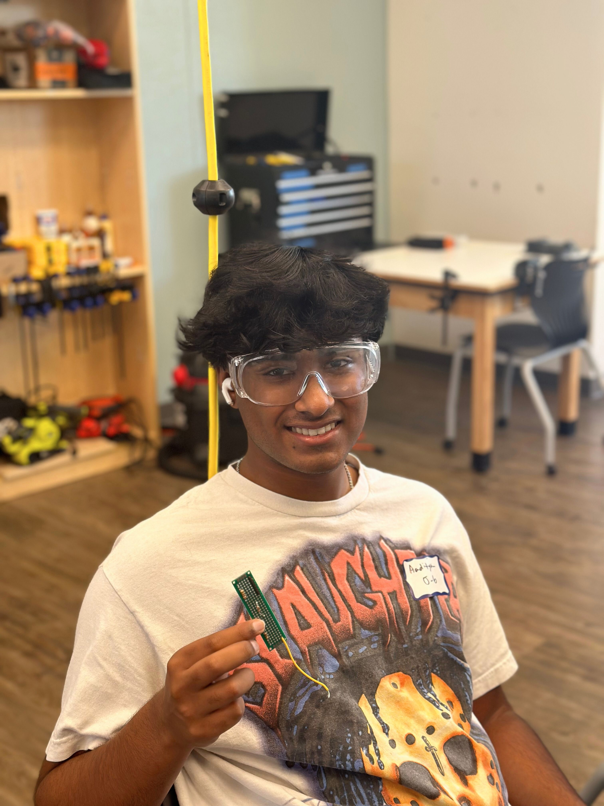
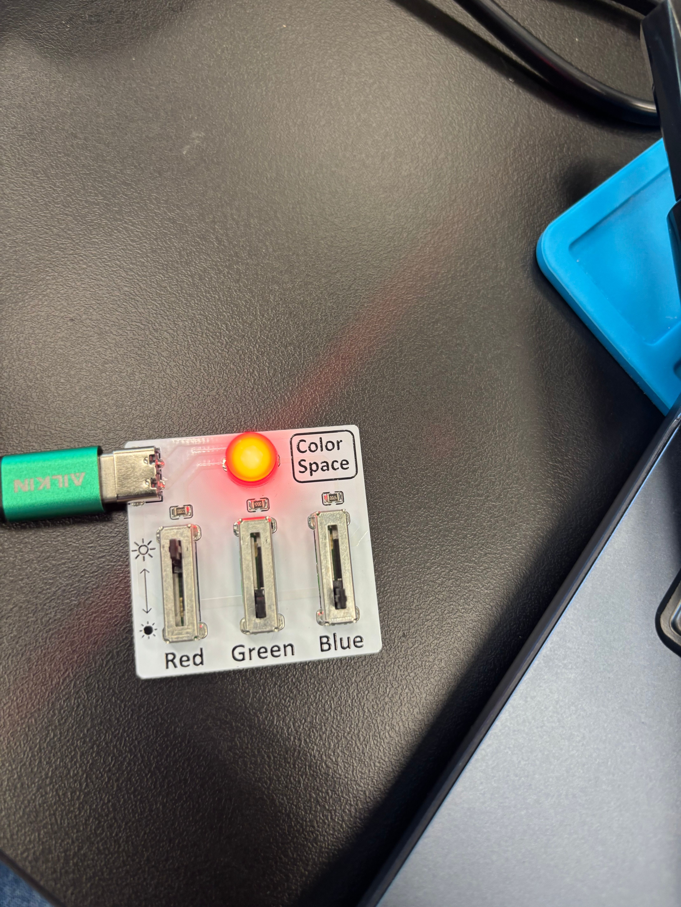

# Real Time Planet Tracker
My project is a Real Time Planet Tracker and this tracks planets with a laser pointer that is powered by a Servo motor. The biggest challenges I had with this project is making the servo motor due to the screwing and getting all of the arduino connections.

| **Engineer** | **School** | **Area of Interest** | **Grade** |
|:--:|:--:|:--:|:--:|
| Aaditya P | California High School| Aerospace Engineering | Incoming Senior


  
<!--# Final Milestone

**Don't forget to replace the text below with the embedding for your milestone video. Go to Youtube, click Share -> Embed, and copy and paste the code to replace what's below.**

<iframe width="560" height="315" src="https://www.youtube.com/embed/F7M7imOVGug" title="YouTube video player" frameborder="0" allow="accelerometer; autoplay; clipboard-write; encrypted-media; gyroscope; picture-in-picture; web-share" allowfullscreen></iframe>

For your final milestone, explain the outcome of your project. Key details to include are:
- What you've accomplished since your previous milestone
- What your biggest challenges and triumphs were at BSE
- A summary of key topics you learned about
- What you hope to learn in the future after everything you've learned at BSE


# Second Milestone

**Don't forget to replace the text below with the embedding for your milestone video. Go to Youtube, click Share -> Embed, and copy and paste the code to replace what's below.**

<iframe width="560" height="315" src="https://www.youtube.com/embed/y3VAmNlER5Y" title="YouTube video player" frameborder="0" allow="accelerometer; autoplay; clipboard-write; encrypted-media; gyroscope; picture-in-picture; web-share" allowfullscreen></iframe>

For your second milestone, explain what you've worked on since your previous milestone. You can highlight:
- Technical details of what you've accomplished and how they contribute to the final goal
- What has been surprising about the project so far
- Previous challenges you faced that you overcame
- What needs to be completed before your final milestone 

# First Milestone

**Don't forget to replace the text below with the embedding for your milestone video. Go to Youtube, click Share -> Embed, and copy and paste the code to replace what's below.**

<iframe width="560" height="315" src="https://www.youtube.com/embed/CaCazFBhYKs" title="YouTube video player" frameborder="0" allow="accelerometer; autoplay; clipboard-write; encrypted-media; gyroscope; picture-in-picture; web-share" allowfullscreen></iframe>

For your first milestone, describe what your project is and how you plan to build it. You can include:
- An explanation about the different components of your project and how they will all integrate together
- Technical progress you've made so far
- Challenges you're facing and solving in your future milestones
- What your plan is to complete your project


# Schematics 
Here's where you'll put images of your schematics. [Tinkercad](https://www.tinkercad.com/blog/official-guide-to-tinkercad-circuits) and [Fritzing](https://fritzing.org/learning/) are both great resoruces to create professional schematic diagrams, though BSE recommends Tinkercad becuase it can be done easily and for free in the browser. 

# Code
Here's where you'll put your code. The syntax below places it into a block of code. Follow the guide [here]([url](https://www.markdownguide.org/extended-syntax/)) to learn how to customize it to your project needs. 

```c++
void setup() {
  // put your setup code here, to run once:
  Serial.begin(9600);
  Serial.println("Hello World!");
}

void loop() {
  // put your main code here, to run repeatedly:

}
-->

# Bill of Materials

| **Part** | **Note** | **Price** | **Link** |
|:--:|:--:|:--:|:--:|
| Arduino Mega 2560 REV3| It is used as the brains of the project | $48.99 | <a href="https://www.microcenter.com/product/621387/arduino-mega-2560-rev3-256kb-(8kb-after-bootloader)-flash-memory/"> Link </a> |
| Neo-6 GPS transmission |This item is used to detect where each planet is| $27.25 | <a href="https://www.u-blox.com/en/product/neo-6-series/"> Link </a> |
| MPU9250| This is used for stability of the alignment | $17.99 | <a href="https://www.amazon.com/HiLetgo-Gyroscope-Acceleration-Accelerator-Magnetometer/dp/B01I1J0Z7Y/"> Link </a> |
| Pan- tilt Mechanism with Servos | What the item is used for | $42.70 | <a href="https://www.mouser.com/ProductDetail/Pimoroni/PIM183?qs=lc2O%252BfHJPVaXow9v4C2FMg%3D%3D&mgh=1&srsltid=AfmBOoogak1-TGBJgu9YiKBZ7QnChSs9LWGuSNQrc7gfcI5SXRs88YEiMP8&gQT=1/"> Link </a> |
| Green Laser Pointer | Show where the planet is in a closed room | $25.99 | <a href="https://www.amazon.com/HITEKK-Pointer-Rechargeable-Tactical-Carrying/dp/B0DJS15VWP?gQT=1/"> Link </a> |
| Power Distrubution Board | Used for Power  | $16.20 | <a href="https://www.keyestudio.com/products/keyestudio-4-channel-l298p-motor-drives-shield-v10-for-arduino-robot/"> Link </a> |
| Potentiometer| to be used as Planet selector and a Switch as Mode Selector. | $4.26 | <a href="https://www.digikey.com/en/products/detail/bourns-inc/PDB241-GTR03-504A2/3780787?gQT=1/"> Link </a>| 


<!--# Other Resources/Examples
One of the best parts about Github is that you can view how other people set up their own work. Here are some past BSE portfolios that are awesome examples. You can view how they set up their portfolio, and you can view their index.md files to understand how they implemented different portfolio components.
- [Example 1](https://trashytuber.github.io/YimingJiaBlueStamp/)
- [Example 2](https://sviatil0.github.io/Sviatoslav_BSE/)
- [Example 3](https://arneshkumar.github.io/arneshbluestamp/) **
-->
# RGB Sliders 


<iframe width="560" height="315" src="https://www.youtube.com/embed/I4OzfxXsNjA?si=r3gweBtMdo1lx9lo" title="YouTube video player" frameborder="0" allow="accelerometer; autoplay; clipboard-write; encrypted-media; gyroscope; picture-in-picture; web-share" referrerpolicy="strict-origin-when-cross-origin" allowfullscreen></iframe>

My starter Project is RGB Sliders and this shows 3 main colors ( Red, Blue, Green) through sliders. To use this you must have it connected with USB-A, once connected you can slide up the sliders and this will activate the colors with the respective slider you push. You can also mix colors by pushing mutliple sliders and have a white light with all 3 sliders pushed. Some challenged I faced was avoiding short circuits because the wires were so close to eachother making soldering pretty difficult. 


